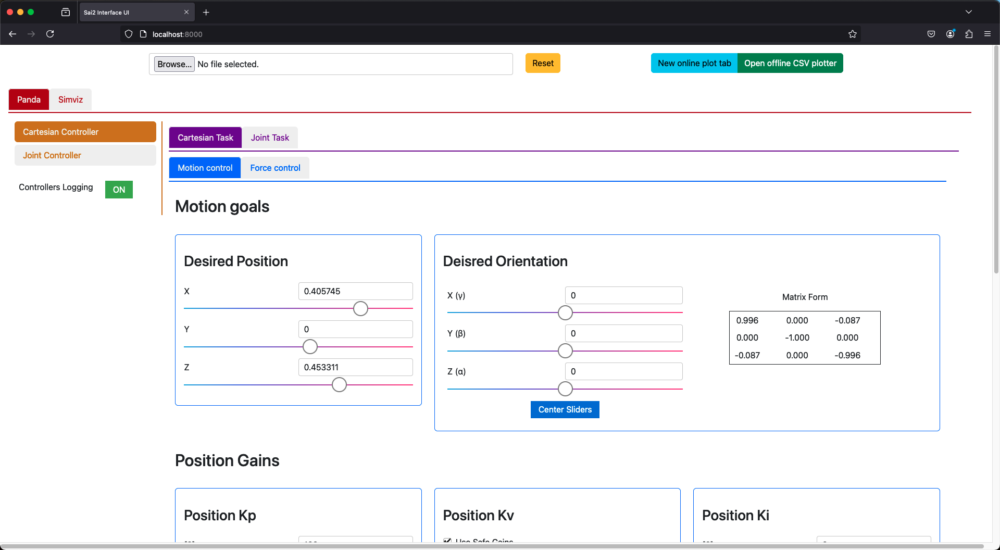

# Sai2-interfaces

sai2-interfaces provides two main tools to enables users to quickly develop controllers and simulations with the sai libraries:
1. Wrappers for controller setup (around [sai2-primitives](https://github.com/manips-sai-org/sai2-primitives) library), simulation (around [sai2-simulation](https://github.com/manips-sai-org/sai2-simulation) library) and graphic visualization (around [sai2-graphics](https://github.com/manips-sai-org/sai2-graphics) library). The code for those is in the `src/` folder. Those wrappers enable:
  + Easy setup and configuration of controllers and simulated worlds from xml/urdf files
  + A lot of interactability with the controllers and simulation/visualization via redis
  + Built-in data logging functionality
  + Automatic generation of a html file for web-based ui interaction with the controller and simulation/visualization
2. A web browser based user interface to interact in real time with the controllers and simulation/visualization. The code for this is in the `ui/` folder. It is split in two parts:
  + The backend server running locally (no internet connection required at runtime) with python
  + The frontend composed of a collection of custom html/css elements such as sliders, toggle buttons, tabs to switch between controllers and so on

## Quickstart

The web based ui has been tested on Chrome/Chromium, Firefox and Safari.
The backend server requires Python 3.5+.

### Dependencies

The UI backend server depends on [Redis](https://pypi.org/project/redis/), [Flask](https://pypi.org/project/Flask/), and [Click](https://pypi.org/project/click/). You can install them as below:

```
pip3 install -r ui/requirements.txt
```

The C++ libraries depend on:
* [sai2-simulation](https://github.com/manips-sai-org/sai2-simulation)
* [sai2-graphics](https://github.com/manips-sai-org/sai2-graphics)
* [sai2-primitives](https://github.com/manips-sai-org/sai2-primitives)

You will need to build those first.

### Build instructions

Build the project with the following commands

```
mkdir build && cd build
cmake .. && make -j4
```

This will build the wrappers for the controllers and simviz, the MainInterface program, and will export `${SAI2-INTERFACES_UI_DIR}` , which points to the absolute path of the `ui/` folder in this repository. You can then use cmake's `FILE(CREATE_LINK)` macro to make a symlink to this directory from another application for easy access (recommended, for an example see the CMakeLists.txt file of [OpenSai](https://github.com/manips-sai-org/OpenSai)), or the `FILE(COPY)` macro to copy it.

### Examples

The build process will also build the `MainRedisInterfaceExample`. This is the program to run for all examples. The examples are actually defined in config files, present in the `examples/config_files/` folder. To run an example, you can follow these instructions:
```
cd build/examples/
./MainRedisInterfaceExample
```

This will run the `panda_simviz_control` config file that simulates and controls a Panda robot. If you want to run another example, let's sau the `double_kuka_simviz_control.xml`, you can add it as an argument in the call of the example:
```
./MainRedisInterfaceExample double_kuka_simviz_control.xml
```

You can interact with the controller, the simulation and even reset the simulation or swap the config file at runtime via the ui interface. To run the interface, open a new terminal, go to the sai2-interfaces root folder and launch the python server to serve the automatically generated webui file:

```
python3 ui/server.py examples/config_files/webui_generated_file/webui.html
```

Now, open a web browser and navigate to the url `localhost:8000`. You should see something like the following:


### Documentation

* For an overview of the ui and how to use it, see [this page](docs/ui_overview.md)
* For details on the config files, how to use them and how to make your own for your application, see [here](docs/config_files_details.md)
* For details on all the UI custom html elements (advanced users only), see the documentation [here](docs/ui_elements_details/ui_docs_menu.md).

## License

Currently pending licensing. PLEASE DO NOT DISTRIBUTE.

## Project contributors

* Mikael Jorda
* Keven Wang
* William Jen

## For questions, contact:

mjorda@stanford.edu or mjorda@jorda-tech.com
