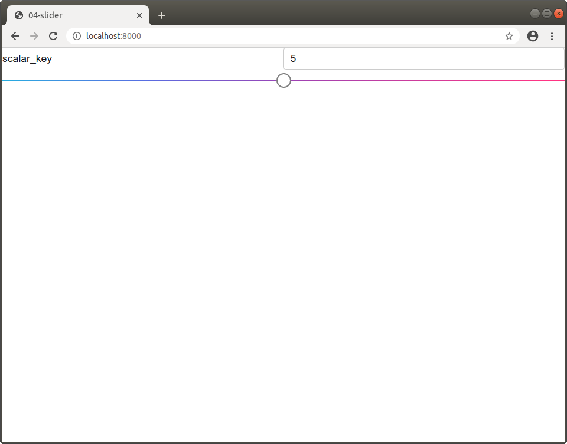
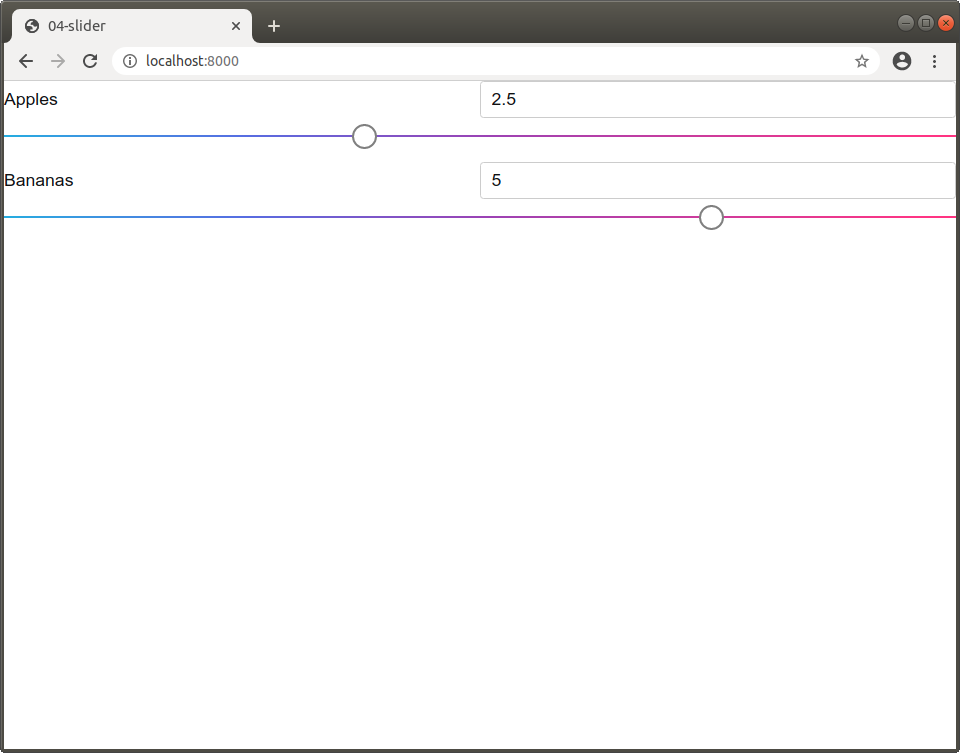

The `sai2-interfaces-slider` Element
====================================
The `sai2-interfaces-slider` element allows you to get/set the values of a 
scalar or vector tied to the Redis key.

## Usage
```
<sai2-interfaces-slider key="..." min="..." max="..." step="...">
</sai2-interfaces-slider>
```

If you specify a vector-valued key with `n` elements, `sai2-interfaces-slider` 
will create `n` sliders, one for each element.

## Attributes
* `key`: Required if you are reading from Redis. The key for which to create a slider. 
Can be a scalar or vector. If this Redis key does not exist, an error will be thrown.
* `size`: Required if making a slider in memory. This is the number of sliders to
generate; i.e. 1 for a scalar, 2 for a 2D vector etc. This is useful if you're
creating a new sai2-interfaces component using a slider. See [sai2-interfaces-orientation](../11-orientation/README.md)
* `display`: Optional. The friendly display name. If omitted, the default will 
be the `key`. If you have a vector-valued key, the name will be the value 
provided `display` plus an index, e.g. `display_name[0]`.
* `min`: Required. The minimum value for the scalar or vector. If you have a 
vector-valued key, you can specify a minimum value for each element in the 
vector.
* `max`: Required. The maximum value for the scalar or vector. If you have a 
vector-valued key, you can specify a maximum value for each element in the 
vector.
* `step`: Required. The amount to increment the slider value by when you drag 
the slider. If you have a vector-valued key, you can specify the step for each
element in the vector.

## Example
Since sliders can handle both scalar-valued and vector-valued Redis keys, 
let's do two examples. We'll start a scalar key called 
`sai2::interfaces::tutorial::scalar_key` and set it to `5`.

Similarly, we'll create a vector key called 
`sai2::interfaces::tutorial::vector_key` and set it to `[3,4]`. 

Writing this into Redis:
```
wjen@wjen-desktop:~/sai2/core/sai2-interfaces$ redis-cli
127.0.0.1:6379> set sai2::interfaces::tutorial::scalar_key 5
OK
127.0.0.1:6379> set sai2::interfaces::tutorial::vector_key [3,4]
OK
127.0.0.1:6379> get sai2::interfaces::tutorial::scalar_key
"5"
127.0.0.1:6379> get sai2::interfaces::tutorial::vector_key
"[3,4]"
127.0.0.1:6379> 
```

### Scalar Example
Let's limit our scalar key to be between 0 and 10. Let's say the step size is 1,
and we'll give a friendly name while we're at it. This HTML should look like 
this:
```
<sai2-interfaces-slider key="sai2::interfaces::tutorial::scalar_key"
  display="scalar_key" min="0" max="10" step="1">
</sai2-interfaces-slider>
```

Let's start up the server now.
```
wjen@wjen-desktop:~/sai2/core/sai2-interfaces$ python3 interface/server.py docs/04-slider/04-slider.html 
 * Restarting with stat
 * Debugger is active!
 * Debugger PIN: 142-257-956
(31058) wsgi starting up on http://127.0.0.1:8000
```

Open your browser to `localhost:8000`, and you should see something like this:



You can drag the slider back and forth, use your mouse wheel to increment or 
decrement the value, and also manually input what value you want in the input 
textbox.

That's pretty much it for scalar values!

### Vector Example

Let's limit each element in the vector be between 0 and 10, and the step size to
be 1 for each element. With a friendly name, our HTML for a vector-valued key 
should look like this:
```
<sai2-interfaces-slider key="sai2::interfaces::tutorial::vector_key"
  display="vector" min="0" max="10" step="1">
</sai2-interfaces-slider>
```

Edit the [04-slider.html](./04-slider.html) file with the new HTML, and if you 
still have the server running from the scalar key part, refresh the page. 
If not, launch the server using the above command in the Scalar Example section.

Your new interface should look like this:


Try moving the sliders - you will see that each element has the same minimum, 
maximum, and step value.

However, what if we want to give each element a custom name, minimum value, 
maximum value, and step? We can do this by revising our HTML as following:
```
<sai2-interfaces-slider key="sai2::interfaces::tutorial::vector_key"
  display='["Apples","Bananas"]' min="[1,2]" max="[5,6]" step="[0.5,1]">
</sai2-interfaces-slider>
```

After editing the HTML, reloading, and messing with the sliders, you could get 
output like this:


