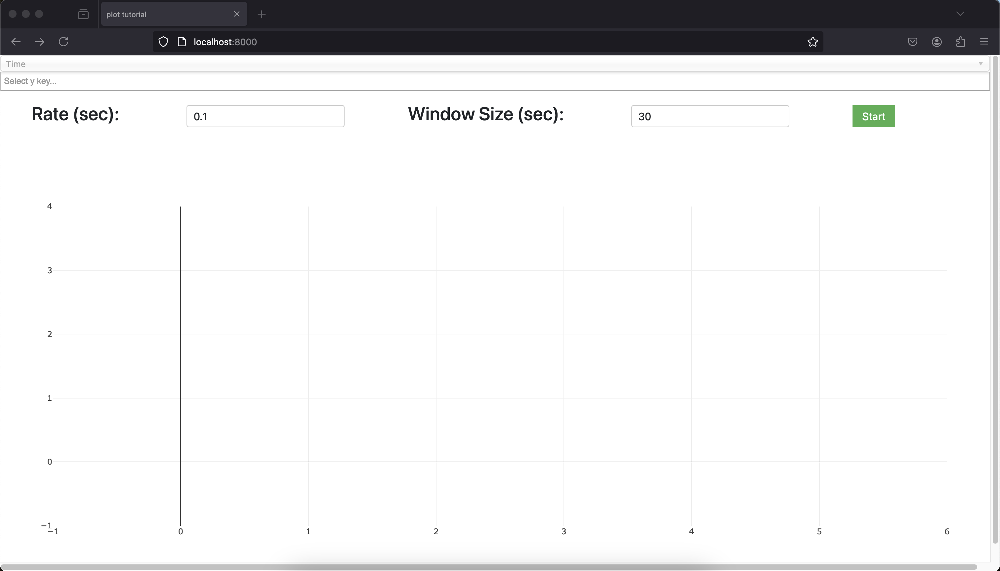
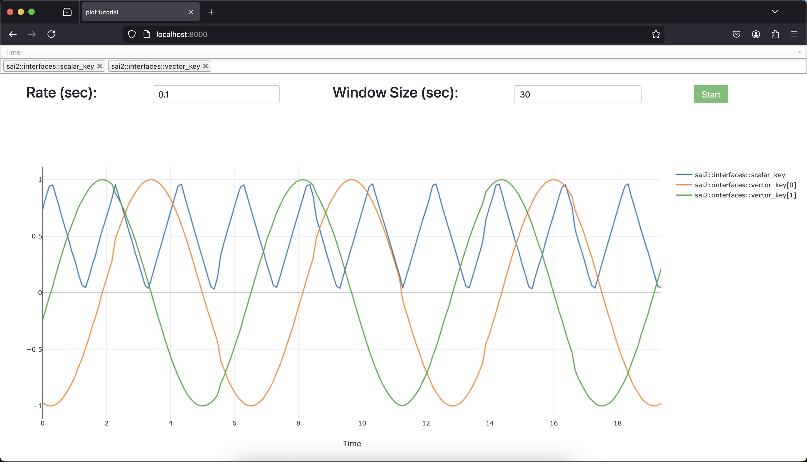
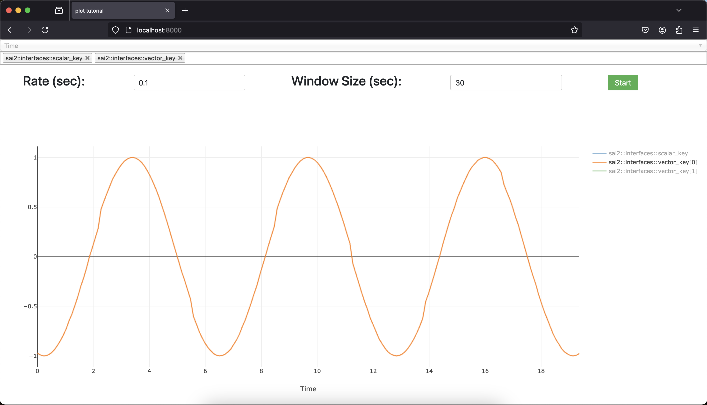

The `sai2-interfaces-plot` Element
====================================
The `sai2-interfaces-plot` element allows you to plot scalar-valued and 
vector-valued Redis keys against time. 



At the top, the first dropdown menu represents the key for the x-axis, which is forced
to be "Time" for now.

Below it is the y-axis keys. Select any number of vector-valued and scalar keys
to plot.

And then there's the Rate input, which is how often to refresh the plot in 
seconds (0.1 by default). There is a maximum refresh rate of 0.033s, so you won't get any better 
plot resolution if you put a refresh rate faster than that.

Finally, there is the Window size in seconds, which corresponds to the maximum
time plotted in the window (30 seconds by default). For example, when the value is 30
then the plot will start and plot the data, and when 30 seconds have passed, only the 
latest 30 seconds will be plotted. If you want to keep everything, you can set a value of 
0 there.

Hit "Start" to start plotting, and hit "Stop" to stop plotting. Within the plot 
window itself, there are various controls, such as zooming and saving to an 
image. That's pretty much it!

## Usage
```
<sai2-interfaces-plot>
</sai2-interfaces-plot>
```

## Attributes
There are no attributes for this element.

## Example

Let's start by first running the provided [writekeys.py](./writekeys.py) script:
```
~/sai2/core/sai2-interfaces$ python3 docs/ui_elements_details/plot/writekeys.py 
Writing keys...
```

Now let's start up the interface:
```
~/sai2/core/sai2-interfaces$ python3 ui/server.py docs/ui_elements_details/plot/plot.html 
```

Then, select the keys `sai2::interfaces::tutorial::scalar_key` and 
`sai2::interfaces::tutorial::vector_key` and a rate of `0.1`. Hit "Start" to 
begin plotting, and click "Stop" when done.



You can save the plot, zoom in, and more on the top right menu of the plot 
itself. If you want to single out certain elements of the plot, you can click on
the appropriate element in the legend on the right of the plot to toggle it on 
and off.


